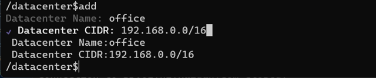

# ZTAS-MERCURY
这是[ZTAS](https://github.com/kaidunztas/ztas)平台的管理端，组织机构的管理员通过该程序注册组织机构的域，管理域内的用户，数据中心、数据中心内的Venus设备，IT服务，EWP管理,NSP管理、DNS管理等。

支持的操作系统：
* Linux：支持
* Windows: 支持
* Mac: 支持


# 下载和安装

## Linux
到[Linux](https://github.com/kaidunztas/ztas-mercury/tree/main/linux) 目录里下载ZIP包，存放于本地，解压即可。

## Windows
到[Windows](https://github.com/kaidunztas/ztas-mercury/tree/main/windows) 目录里下载ZIP包，存放于本地，解压即可。

## Mac
到[Mac](https://github.com/kaidunztas/ztas-mercury/tree/main/darwin) 目录里下载ZIP包，存放于本地，解压即可。


# 启动

## Linux
1. 打开一个命令行窗口
2. 转到本程序的解压目录
3. 输入以下命令：./mercury

## Windows
1. 打开一个命令行窗口
2. 转到本程序的解压目录
3. 输入以下命令：.\mercury.exe

## Darwin
1. 打开一个命令行窗口
2. 转到本程序的解压目录
3. 输入以下命令：./mercury

# 基本命令
本程序提供了一个交互式命令行窗口。


## ls指令
ls指令用于查询当前路径下所有可用的子目录，以及可用的命令。其中
* 子目录：用绿颜色文字标识，包括子目录名称以及描述，并且在Flags栏带d字母。
* 命令：用蓝颜色文字标识，包括命令名称以及描述，并且在Flagsl栏带e字母。

## cd指令
cd指令用于更改当前路径，分三种场景：
1. 进入子目录：在提示符下输入cd dir，其中dir是你要进入的子目录名字。
2. 返回上级目录：在提示符下输入cd .., 表示回到上级目录。
3. 回到根目录：在提示符下输入cd /，表示要回到根目录。

## 执行命令
在提示符下输入可以执行的命令名称即可，比如输入rename即执行rename命令。

## 退出程序
在根目录下，执行exit命令即可退出程序。

# 功能说明

## 1.注册域
组织机构要用本平台的零信任访问服务之前，第一步要先注册组织机构的域。
要注册域，需要在本命令行窗口的根目录输入执行以下步骤：

```
1. 输入reg命令
2. 出现提示，要求你输入Domain ID，请输入一个以"."分割的域名，比如abc.com, abc.org等，类似于互联网的顶级域名。
3. 在输入组织机构名称，比如"abc company"。
4. 如果域名注册成功，会提示相应的信息，否则会提示域名已存在。
```

## 2.域管理员登录
域管理员在使用本程序之前，需要先用域管理员的令牌登录。

在打开本程序后，在根目录的窗口输入login命令，会显示如下登录界面：


在登录界面中，输入域管理员的令牌，即可完成登录。

## 3.用户管理
域创建成功后，要对域下的用户进行管理。每个域有一个管理员账号。

从根目录执行cd users命令，即可进入用户管理界面。


注意：

<font color="red">每个用户有一个唯一的令牌，令牌由16个字符构成，用户凭借该令牌登录平台，因此，每个用户的令牌需要妥善保管，一旦令牌丢失，将无法访问该平台。</font>

可执行命令列表


* add: 添加域用户
* open: 从当前页打开指定的域用户
* next: 显示下一页域用户列表
* prev: 显示上一页域用户列表
* cur: 显示当前页域用户列表

### 3.1添加用户
在用户管理界面输入add命令，程序会出现如下的界面：


用户创建成功后，系统会提示该用户的令牌。

### 3.2打开用户
在用户管理界面输入open命令，程序会显示如下界面，让你选择要打开的用户：


选择以后，按回车，即打开该用户，进入该用户的管理界面。


用户管理界面提供以下几个命令：
* token: 显示当前[用户的令牌](#user_token)
* reset: [重设](#user_reset)当前用户的令牌
* info: [显示](#user_info)当前用户的信息
* del: 删除当前用户

### 3.3<a name="user_token">显示用户令牌</a>
用户令牌是用户访问平台的唯一凭证，令牌由16个字符组成，由平台随机生成，平台内唯一。因此用户的令牌需要由用户妥善保管。

在打开用户后，在命令行窗口输入token命令，系统会显示当前用户的令牌。

### 3.4<a name="user_reset">重设用户令牌</a>
在打开用户后，在命令行窗口输入reset命令，系统会显示如下的界面，让你确认是否要重设令牌，当选择Yes后，即可重设当前用户的令牌，并且使原有的令牌失效。


注意：<font color="red">当用户的令牌重设后，通过该令牌登录的程序，都要重新输入新令牌。</font>

### 3.5<a name="user_info">显示用户信息</a>
在打开用户后，在命令行窗口输入info命令，即可显示该用户的简要信息。如下图所示：


### 3.6<a name="user_del">删除用户</a>
在打开用户后，在命令行窗口输入del命令，程序会显示如下界面，让管理员确认是否要删除当前用户。如下图所示：


## 4.数据中心管理
打开程序并且登录后，在命令行窗口的根目录，输入cd datacenter指令，即可进入数据中心管理界面。


数据中心首页提供以下命令：
* open: 打开指定数据中心
* add: 添加数据中心
* next: 显示下一页数据中心记录
* prev: 显示上一页数据中心记录
* cur: 显示当前页数据中心记录

### 4.1添加数据中心
在数据中心首页，输入add命令，程序会显示添加数据中心界面，如下图所示：



在上面的界面中，输入：
* 数据中心名字
* 数据中心CIDR，CIDR是Classless Inter-Domain Routing的缩写，中文名叫无类别域间路由，是一个用于给用户分配IP地址以及在互联网上有效地路由IP数据包的对IP地址进行归类的方法，该值定义了数据中心的网段，在本平台中，该值并无实际作用，仅供管理员方便管理。

数据中心创建成功后，在命令行窗口输入refresh指令刷新数据中心列表。

### 4.2打开数据中心
在数据中心首页，输入open命令，程序会显示如下界面，让你选择要打开的数据中心。


选择要打开的数据中心后，按回车确认，系统会进入选择的数据中心实例的管理界面，如下图所示。


数据中心实例管理界面提供以下子目录和命令：
* venus子目录：查看并管理当前数据中心下所有Venus设备
* itservice子目录：查看并管理当前数据中心的所有IT服务
* public子目录：查看并管理当前数据中心的所有公网IP
* nat子目录：查看并管理当前数据中心的NAT记录
* info命令：查看当前数据中心的信息
* del命令：删除当前数据中心实例
* update命令：更新当前数据中心的信息

#### 4.2.1 数据中心Venus设备管理
在数据中心实例管理界面，输入cd venus，即可进入当前数据中心的Venus设备管理界面，如下图所示：


Venus设备管理页面提供以下命令：
* open: 打开指定的Venus设备
* next: 显示下一页Venus设备列表
* prev: 显示上一页Venus设备列表
* cur: 显示当前页Venus设备列表

#### 4.2.2 打开Venus设备
在数据中心的Venus设备管理界面，输入open命令，会显示Venus设备选择界面，如下图所示：


选择要打开的Venus设备后，按回车，即进入该Venus设备的管理界面，如下图所示。


Venus设备管理提供以下子目录和命令：
* ingress子目录: 查看并管理Venus设备的入栈安全规则
* egress子目录: 查看并管理Venus设备的出栈安全规则
* edit: 编辑当前Venus设备的名字
* info: 查看当前Venus设备的信息
* ethernet: 更改当前Venus设备的网卡保护状态

### 4.2.3 查看并管理Venus设备的Ingress安全规则
在打开Venus设备后，在Venus设备的首页输入命令cd ingress即可进入该设备的Ingress安全规则管理界面，如下图所示：


Ingress安全规则代表流入当前设备网卡的安全规则，不符合安全规则的流量将被拦截，而对符合安全规则的流量给予放行。

Ingress安全规则管理提供如下命令：
* filter: 过滤安全规则列表，当安全规则太多的时候，用过滤器过滤掉不符合搜索条件的规则
* del: 删除安全规则
* add: 添加安全规则
* next: 显示下一页安全规则列表
* prev: 显示上一页安全规则列表
* cur: 显示当前页安全规则列表

#### 4.2.3.1 添加Ingress安全规则
在[Ingress安全规则管理](#423-查看并管理venus设备的ingress安全规则)界面，输入add命令，程序会显示添加Ingress安全规则界面：


其中：
* Dest Addr: 指要保护的IT Service的IPv4地址
* Dest Port: 指要保护的It Service的端口
* Protocol: 指IT Service的协议，允许选择tcp或者udp，目前只对tcp协议有效
* Source Type: 源类型，指要通过什么源信息对IT Service进行身份验证，fp指会话中必须包含指定的指纹，ip指会话中必须包含指定的源IP地址
* Source: 源，当Source Type为fp时，该值必须为32个字符的指纹，当Source Type为ip时，该值必须为IPv4地址
* Policy: 策略，当会话符合前述条件时，采取的安全策略，accept表示放行，reject代表拒绝，ztp在这里无效值

#### 4.2.3.2 删除Ingress安全规则
在[Ingress安全规则管理](#423-查看并管理venus设备的ingress安全规则)界面，输入del命令，程序会显示删除Ingress安全规则界面：


在列表中通过上下方向键选择要删除的安全规则，并按回车确认，然后将光标移到Done，按回车确认，系统会提示你是否要删除这些安全规则，如果选择y，则会删除这些安全规则。

### 4.2.4 查看并管理Venus设备的Egress安全规则
在打开Venus设备后，在Venus设备的首页输入命令cd egress即可进入该设备的Ingress安全规则管理界面，如下图所示：


#### 4.2.4.1 添加Egress安全规则
在[Egress安全规则管理](#424-查看并管理venus设备的egress安全规则)界面，输入add命令，程序会显示添加Egress安全规则界面：


其中：
* Dest Addr: 指要保护的IT Service的IPv4地址
* Dest Port: 指要保护的It Service的端口
* Protocol: 指IT Service的协议，允许选择tcp或者udp，目前只对tcp协议有效
* Source Type: 源类型，指要通过什么源信息对IT Service进行身份验证，fp指会话中必须包含指定的指纹，ip指会话中必须包含指定的源IP地址
* Source: 源，当Source Type为fp时，该值必须为32个字符的指纹，当Source Type为ip时，该值必须为IPv4地址
* Policy: 策略，当会话符合前述条件时，采取的安全策略，accept表示放行，reject代表拒绝，ztp代表将当前设备的指纹注入本地发起的，以Dest Addr和Dest Port为目标的TCP会话。

#### 4.2.3.2 删除Ingress安全规则
在[Ingress安全规则管理](#423-查看并管理venus设备的ingress安全规则)界面，输入del命令，程序会显示删除Ingress安全规则界面：


在列表中通过上下方向键选择要删除的安全规则，并按回车确认，然后将光标移到Done，按回车确认，系统会提示你是否要删除这些安全规则，如果选择y，则会删除这些安全规则。

### 4.2.5 管理Venus的Ethernet
Venus设备的安全规则，都是通过对设备上的Ethernet(网卡)上的数据包(Packet)进行分析处理实现的。
* 对于Ingress安全规则，需要打开Ethernet上的ingress选项，这些安全规则才能生效。
* 对于Egress安全规则，需要打开Ethernet上的egress选项，这些安全规则才能生效。

在打开Venus设备后，在Venus设备的首页输入命令etherent，即可进入Ehternet管理界面。如下图所示：


在上图中，ingress代表该ehternet的ingress安全规则生效，如果有egress，则代表egress安全规则生效

选择了Ethernet后，显示该Ehternet的编辑界面，如下图所示：


在Ethernet编辑界面，可以做如下编辑：
* IPv4 Address: 更改Ethernet的IPv4地址，这个值的改变，并不会更改Ehternet的实际地址
* IPv6 Address: 更改Ethernet的IPv6地址，这个值的改变，并不会更改Ehternet的实际地址
* Protection: 零信任保护选项，ingress选中，代表ingress安全规则生效，egress选中代表egress安全规则生效。


### 4.2.6 数据中心IT服务管理
当[打开](#42打开数据中心)指定的数据中心后，在当前数据中心的首页输入cd itservice，即进入数据中心的IT服务管理界面。


IT服务管理首页提供以下命令：
* add: 添加IT服务
* del: 删除IT服务
* edit: 编辑IT服务
* bind: 将IT服务与特定的Venus设备绑定
* next: 显示下一页IT服务列表
* prev: 显示上一页IT服务列表
* cur: 显示当前页IT服务列表


#### 4.2.6.1 添加IT服务
在IT服务管理首页，输入命令add即可添加IT服务，如下图所示：


其中：
* Name: 指IT服务名称
* IPv4 Address: IT服务的IPv4地址，必须要填
* IPv6 Address: IT服务的IPv6地址，可填，目前不支持IPv6地址
* Port: IT服务的端口
* Protocol: IT服务的协议类型，目前只支持tcp

#### 4.2.6.2 编辑IT服务
在IT服务管理首页，输入命令edit即可进入IT服务编辑页面，会让你先选择要编辑的IT服务，如下图所示：


编辑部份的界面请参考添加IT服务，此处略。

#### 4.2.6.3 删除IT服务
在IT服务管理首页，输入命令del即可进入IT服务删除页面，会让你先选择要删除的IT服务，如下图所示：


#### 4.2.6.4 绑定Venus设备
IT服务创建好后，需要将该服务跟指定的Venus设备绑定，才能由该Venus设备对该IT服务进行零信任保护。

在IT服务管理首页，输入命令bind即可进入IT服务绑定界面，先让你选择要绑定的IT服务，如下图所示：


然后选择要绑定的Venus设备，如下图所示：


### 4.2.7 数据中心公网IP管理
一般的数据中心都有一个或者多个固定的公网IP，用于对互联网提供IT服务，以及实现数据中心之间的通信。

域管理员将分配给数据中心的固定公网IP记录下来，才能将数据中心内的IT服务映射成NAT记录，从而让其他数据中心的Venus设备或者Mars设备直接通过公网IP访问IT服务，而不需要通过安全隧道，从而在确保安全的前提下提升访问效率。

当[打开](#42打开数据中心)指定的数据中心后，在当前数据中心的首页输入cd public，即进入公网IP管理界面，如下图所示：


公网IP管理提供以下命令：
* add: 添加公网IP
* del: 删除公网IP
* next: 显示下一页公网IP列表
* prev: 显示上一页公网IP列表
* cur: 显示当前页公网IP列表

#### 4.2.7.1 添加公网IP
在公网IP管理首页，输入命令add，即可显示添加公网IP界面，如下图所示：


#### 4.2.7.2 删除公网IP
在公网IP管理首页，输入命令add，即可显示添加公网IP界面，如下图所示：


### 4.2.8 数据中心NAT记录管理
对于拥有固定公网IP的数据中心，需要在路由器上添加NAT记录，才能让外部访问数据中心内部的IT服务。

域管理员需要将路由器上的NAT记录添加到平台的数据中心里，这样其他数据中心的Venus设备以及Mars终端才能在保证安全的前提下，通过NAT地址访问数据中心内的IT服务，而无需通过安全隧道，从而提升访问的效率。

当[打开](#42打开数据中心)指定的数据中心后，在当前数据中心的首页输入cd nat命令，即可进入数据中心的NAT记录管理界面，如下图所示：


NAT记录管理提供以下命令：
* add: 添加NAT记录
* del: 删除NAT记录
* next: 显示下一页NAT记录列表
* prev: 显示上一页NAT记录列表
* cur: 显示当前页NAT记录列表

#### 4.2.8.1 添加NAT记录
在NAT记录管理首页，输入add命令， 即可显示添加NAT记录界面，如下图所示：


选择要映射的IT服务，按回车，会显示如下界面，让你选择公网IP，如下图所示：


选择了公网IP后，在输入IT服务在公网上的端口，即可完成NAT记录的添加。

#### 4.2.8.2 删除NAT记录
在NAT记录管理首页，输入del命令， 即可显示删除NAT记录界面，如下图所示：


## 5. EWP管理
EWP是East/West Protection的缩写，即东/西向访问保护，用于保护Venus设备之间的IT服务的零信任保护，确保只有受信任的Venus设备才能访问IT服务。EWP最终是通过Venus设备上的安全规则来实现的，但通过EWP可以更加方便地对Venus设备之间的IT服务进行访问权限控制。

在程序首页，输入命令ewp即可进入EWP管理界面，如下图所示：


EWP首页里，会显示EWP记录，每条EWP记录包含以下信息：
* IT服务：包括Protocol(协议)、Service Name(服务名)，Service Address(服务地址)
* Source Venus: 可以访问该IT服务的Venus设备
* Dest Venus:保护该IT服务的Venus设备，在这里就是IT服务所绑定的那台Venus设备

EWP首页支持以下操作：
* add: 添加EWP记录
* del: 删除EWP记录
* next: 显示下一页EWP记录列表
* prev: 显示上一页EWP记录列表
* cur: 显示当前页EWP记录列表

### 5.1 添加EWP记录
在EWP管理首页，输入add命令， 即可进入添加EWP记录界面，如下图所示：


先选择要访问的IT服务，然后进入第二步，如下图所示：


选择源Venus设备，即允许访问IT服务的Venus设备，然后进入第三步，如下图所示：


选择目标Venus设备，即对IT服务进行保护的Venus设备，这一步只能选择IT服务绑定的Venus设备。

确认后，即完成一条EWP记录的添加。

### 5.2 删除EWP记录
在EWP管理首页，输入del命令， 即可进入删除EWP记录界面，如下图所示：


## 6. DNS管理
域管理员可以当前域名作为私有顶级域名，定义并管理DNS，建立私有的域名，当Mars终端登录本平台后，会在设备上运行域名服务器，从平台上拉DNS记录，并提供本机的域名解析服务。

在程序的根目录，输入命令dns，即进入DNS管理，如下图所示：


每条DNS记录，由域名前缀和顶级域名构成，顶级域名就是组织机构在注册时候使用的域名，以及该记录所指向的IPV4地址，换言之，每条NDS记录都是A记录。

### 6.1 添加DNS记录
在DNS管理首页，输入add命令，即可进入添加DNS记录界面，如下图所示：


先选择DNS记录所对应的IP地址所在的数据中心，确定后，进入下一步，如下图所示：


输入域名前缀，以及对应的IPv4地址。添加记录成功后，会显示如下界面：


### 6.2 删除DNS记录
在DNS管理首页，输入del命令，即可进入DNS记录杀出界面，如下图所示：


选择要删除的DNS记录，并确认后，程序会提示是否确认删除记录，选择Y后，会将选中的DNS记录删除。

